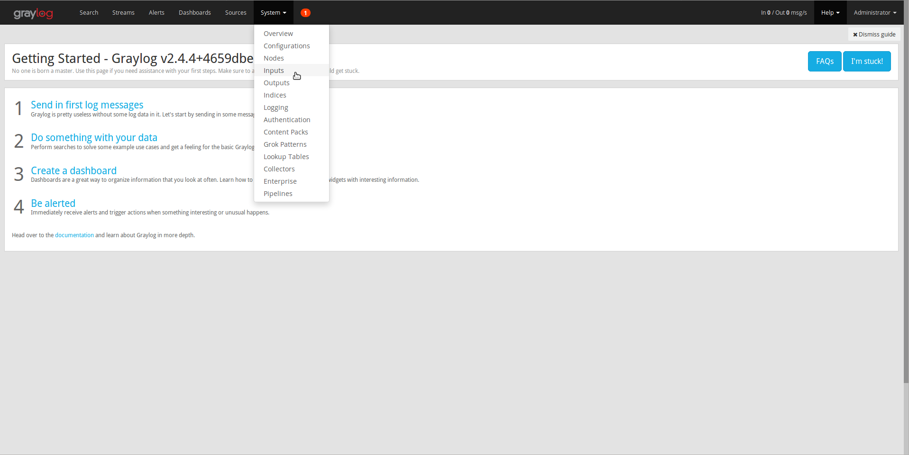
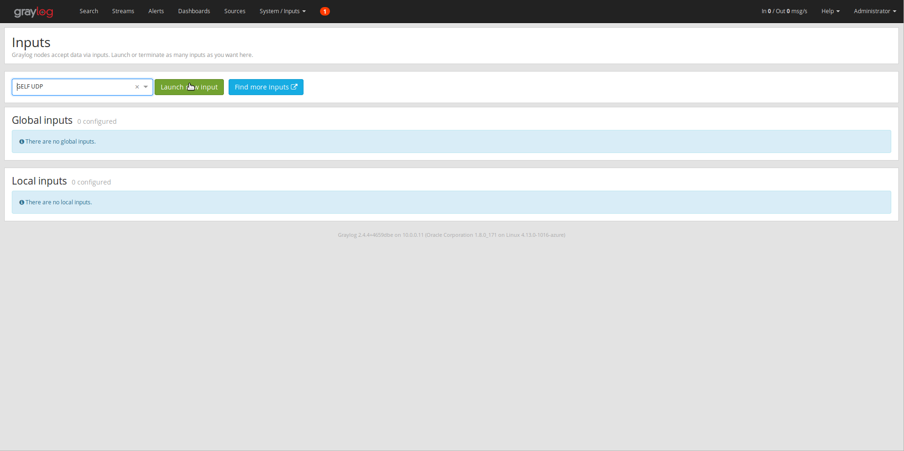
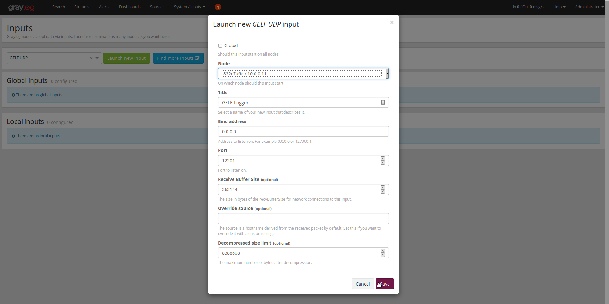
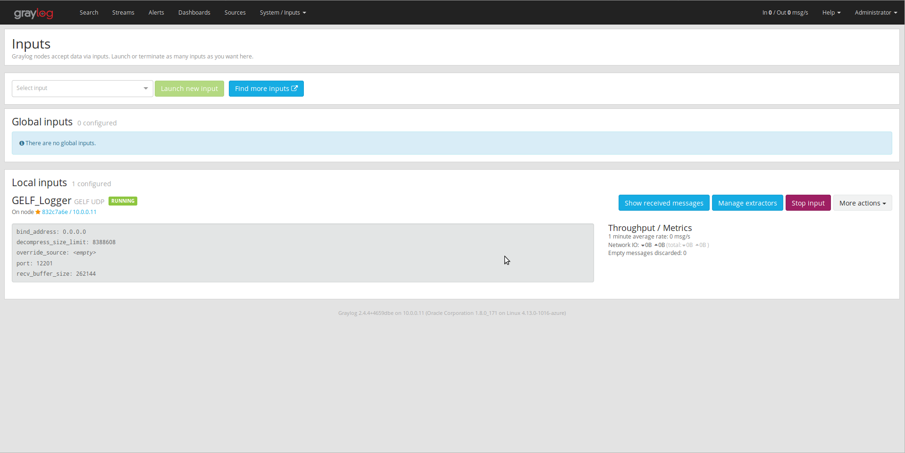

# graylog2

[](https://www.npmjs.org/package/graylog2)
[](https://www.npmjs.org/package/graylog2)

Graylog2 client library for Node.js

## Installation

```sh
npm install graylog2 --save
```

## What is Graylog?

Graylog is popular logging software. You can get it at http://www.graylog2.org. Incidentally, since this package
uses Graylog's [GELF](http://docs.graylog.org/en/latest/pages/gelf.html) protocol, you can also use this with other
logging software that has GELF support.

## Usage

### Available functions

* graylog.emergency(short, full, fields, timestamp)
* graylog.alert(short, full, fields, timestamp)
* graylog.critical(short, full, fields, timestamp)
* graylog.error(short, full, fields, timestamp)
* graylog.warning(short, full, fields, timestamp)
* graylog.notice(short, full, fields, timestamp)
* graylog.info(short, full, fields, timestamp)
* graylog.debug(short, full, fields, timestamp)

Arguments:

- short (string): A short message to log.
- full (string, optional): Additional details.
- fields (object, optional): An object of key/value pairs to help with filtering.
- timestamp (integer, optional): A custom timestamp (milliseconds).

### Code snippets

```js
var Graylog = require('graylog2');
var logger = new Graylog({
    servers: [
        { host: '127.0.0.1', port: 12201 },
        { host: '127.0.0.2', port: 12201 }
    ],
    hostname: 'server.name', // the name of this host (optional, default: os.hostname())
    facility: 'Node.js',     // the facility for these log messages (optional, default: "Node.js")
    bufferSize: 1350         // max UDP packet size, should not exceed the MTU of your network (optional, default: 1400)
});

logger.on('error', function (error) {
    console.error('Error while trying to write to Graylog2:', error);
});

logger.on('warning', function (error) {
	console.error('Non-fatal error while trying to write to Graylog2:', error);
});
```

Short message:

```js
logger.debug("What we've got here is...failure to communicate");
```

Long message:

```js
var short = "What we've got here is...failure to communicate";
var long = "Some men you just can't reach. So you get what we had here last week, " +
	"which is the way he wants it... well, he gets it. I don't like it any more than you men.";

logger.debug(short, long);
```

Short with additional data:

```js
logger.debug("What we've got here is...failure to communicate", { cool: 'beans' });
```

Long with additional data:

```js
var short = "What we've got here is...failure to communicate";
var long = "Some men you just can't reach. So you get what we had here last week, " +
	"which is the way he wants it... well, he gets it. I don't like it any more than you men.";

logger.debug(short, long, { cool: 'beans' });
```

Send all pending log messages and close the socket:

```js
logger.close(function () {
    console.log('All done!');
});
```

### More examples

    npm install graylog2

## Graylog2 Configuration

This module will send its data as GELF packets to Graylog2. In order to see your data in the correct format you need to create a GELF Input in your Graylog2 application. 

You can do this by following these instructions:

1. Go to System -> Inputs

<div align="center">
    
</div>

2. Select a GELF Input type. In this case we will be using GELF UDP as it doesn't need any additional configuration.

<div align="center">
    
</div>

3. Select the Nodes that will read the new Input type.

<div align="center">
    
</div>

4. Launch the new input!

<div align="center">
    
</div>
